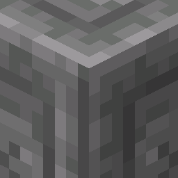

# D°Uzi Craft: Dessert Port

<h1 style="text-align: center;">
  
</h1>
D°Uzi Craft is a resource pack that aims to make Minecraft visually enjoyable in a fresh way, without drastically changing the game's art style.

As the name suggests: this is a port of a resource pack of the same name. You can see it [here.](
https://www.planetminecraft.com/texture-pack/d-uzi-craft/)

The goal of this project is to ensure that players from both Java and Bedrock can have a near seamless experience, with little to no major changes from either versions.

## A few of the changes:

1. Fixed many texture inconsistencies in blocks such as copper blocks, bricks, ancient debris, and more!
2. Updated outdated UI and Hotbar elements.
3. Major texture changes to blocks, weapons, tools, and armor to look more aesthetically pleasing.
4. New C418 music, replacing 11 and 13.
5. Updated sounds for many blocks.
6. A fresh coat of paint to some outdated mobs! (And some variants, some from nametags, others naturally!)
7. Baby variants for every mobs that has one, look at their adorable faces!!!!!!!! (but not in a weird way)*
> - This only applies to versions before 26.1.
8. Variations for some blocks.
9. Unique for the pale garden.
10. Double slab textures for most slabs, which creates room for more creativity!*

> - this gif is outdated by 3 years

## Mod dependencies:
On its own, D°Uzi Craft: Dessert Port doesn't need any mods in order to run without issues. Just open any vanilla client, and you are ready to go!

However, for the full experience, you will need the following mods:

<!-- this looks ugly in tis raw form -->

| Mod | Needed for: |
| ---------- | ------------- |
| [ETF](https://modrinth.com/mod/entitytexturefeatures) + [EMF](https://modrinth.com/mod/entity-model-features)/[Optifine](https://optifine.net/home) | All mob models and textures |
| [Polytone](https://modrinth.com/mod/polytone) | Pale garden fog, darker roofed forest leaves and block sounds |
| [Continuity](https://modrinth.com/mod/continuity)/[Optifine](https://optifine.net/home) | Lilypad variants (see FAQ as to why) |

## FAQ:

- Q: Why are some features missing?
- A: The pack can only port what is possible via resource packs, both in vanilla and through active mods. You can look at the changelog in order to have insight on some of my decisions.
- Q: About the lilypads...
- A: In order to properly explain, you would have to know that block variations are done through models. This doesn't seem that bad, until you have a case like mine.
  - There are 5 lilypad variants and 9 lilypad flower variants. Multiplying them gives 45 different models. Add onto the fact that each texture has its own weight, and you can see why this was done.
- Q: Why are the cats broken?
- A: This seems to be more of an EMF thing than a bug by this pack. Downgrading to any version before 3.2 (if it hasnt been fixed) or disabling compiled animations will prevent this.
- Q: Isn't there already a java port?
- A: You mean [this one?](https://modrinth.com/resourcepack/duzi-craft-(java-edition)) I know about it, but some of its shortcomings have influenced my decision to make this.
   - For example: Many of the mobs have broken models/missing parts, so this pack fixes that.
   - Another one: Instead of using a stable release, 
   - None of its assets have been used to make this port, all of it has been made from scratch, as i figured it would be alot better to do so that way, than to fix it.

## License
This resource pack is licensed under the [Creative Commons Attribution-NonCommercial-ShareAlike 4.0 International](https://creativecommons.org/licenses/by-nc-sa/4.0/?ref=chooser-v1) license. Some things, such as content creation, are excluded from certain parts of this license. For more info, view the license document provided in this [Git repo.](https://github.com/incyada/duzi-craft-dessert-port/blob/main/LICENSE)

## Special thanks:

- D°Uzi: Original creator of D°Uzi Craft
- Vanilla Tweaks: Removed Bowl eating and Bedrock piston arm
- Traben: Creator of EMF and CEM
- Pepper_Bell: Creator of Continuity
- MehVahdJukaar: Creator of Polytone
- Optidocs: documentation for some optifine features
- Masaki: Original pack porter
- And YOU: for using this pack!